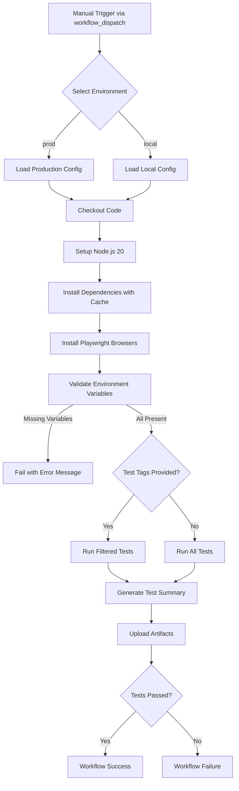
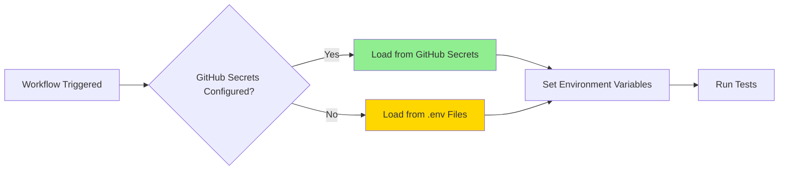

# GitHub Actions Workflow Documentation

## Overview

This directory contains the GitHub Actions workflow for automated Playwright testing of the HR Employee DB Automation project. The workflow provides flexible test execution with proper environment variable management, comprehensive artifact collection, and detailed reporting.

## Table of Contents

1. [Workflow Architecture](#workflow-architecture)
2. [Quick Start](#quick-start)
3. [Workflow Configuration](#workflow-configuration)
4. [Advanced Configuration](#advanced-configuration)
5. [Troubleshooting Guide](#troubleshooting-guide)
6. [Best Practices](#best-practices)
7. [Customization Options](#customization-options)

---

## Workflow Architecture

### High-Level Flow



### Environment Variable Loading Strategy



**Precedence Order:**
1. **GitHub Secrets** (Highest Priority) - Secure, encrypted values
2. **.env Files** (Fallback) - Local development files

### Workflow Components

| Component | Purpose | Configuration |
|-----------|---------|---------------|
| **Trigger** | Manual workflow dispatch | `workflow_dispatch` with inputs |
| **Environment** | Ubuntu latest runner | `runs-on: ubuntu-latest` |
| **Timeout** | Prevent hanging jobs | 60 minutes |
| **Node.js** | Runtime environment | Version 20 with npm cache |
| **Playwright** | Test framework | Installed with system dependencies |
| **Validation** | Pre-flight checks | Custom shell script |
| **Execution** | Test runner | Conditional tag filtering |
| **Reporting** | Results summary | GitHub Actions summary |
| **Artifacts** | Test outputs | 30-day retention |

---

## Quick Start

### Prerequisites

1. **GitHub Secrets configured** (recommended) or `.env` files present
2. **Repository access** with workflow execution permissions
3. **Test environment** accessible from GitHub runners

### Running the Workflow

1. **Navigate to Actions tab** in your GitHub repository
2. **Select "Playwright Tests"** from the workflows list
3. **Click "Run workflow"** dropdown button
4. **Configure inputs:**
   - **Environment**: Select `prod` or `local`
   - **Test Tags**: (Optional) Enter tags like `@user-management`
5. **Click "Run workflow"** button
6. **Monitor execution** in the workflow run page

### Example Scenarios

#### Run All Tests in Production
```
Environment: prod
Test Tags: (leave empty)
```

#### Run User Management Tests in Local
```
Environment: local
Test Tags: @user-management
```

#### Run Multiple Tagged Tests
```
Environment: prod
Test Tags: @user-management|@role-management
```

---

## Workflow Configuration

### Input Parameters

#### test_env (Required)

**Description:** Test environment selection

**Type:** Choice (dropdown)

**Options:**
- `local` - Local development environment
- `prod` - Production environment

**Default:** `prod`

**Usage:**
- Determines which `.env` file to use as fallback
- Included in artifact naming
- Displayed in test summary

#### test_tags (Optional)

**Description:** Test tags for filtering

**Type:** String (text input)

**Format:** Playwright grep pattern

**Examples:**
- `@user-management` - Run tests tagged with @user-management
- `@role-management` - Run tests tagged with @role-management
- `@user-management|@role-management` - Run tests with either tag
- `@smoke` - Run smoke tests only

**Usage:**
- Passed to Playwright as `--grep` flag
- Allows selective test execution
- Leave empty to run all tests

### Environment Variables

#### System Variables

| Variable | Value | Purpose |
|----------|-------|---------|
| `CI` | `true` | Indicates CI environment |
| `test_env` | Input value | Environment selection |

#### Application Variables (from GitHub Secrets)

| Variable | Required | Description |
|----------|----------|-------------|
| `BASE_URL` | ✅ | Application base URL |
| `TEST_SUPER_ADMIN_EMAIL` | ✅ | Super admin email |
| `TEST_SUPER_ADMIN_PASSWORD` | ✅ | Super admin password |
| `TEST_ADMIN_EMAIL` | ✅ | Admin email |
| `TEST_ADMIN_PASSWORD` | ✅ | Admin password |
| `TEST_MANAGER_EMAIL` | ✅ | Manager email |
| `TEST_MANAGER_PASSWORD` | ✅ | Manager password |
| `TEST_EMPLOYEE_EMAIL` | ✅ | Employee email |
| `TEST_EMPLOYEE_PASSWORD` | ✅ | Employee password |
| `TEST_SHADOW_SBU_EMAIL` | ✅ | Shadow SBU email |
| `TEST_SHADOW_SBU_NAME` | ✅ | Shadow SBU name |
| `TEST_SHADOW_SBU_PASSWORD` | ✅ | Shadow SBU password |

**Setup Guide:** See [GitHub Secrets Setup Documentation](../../docs/GITHUB_SECRETS_SETUP.md)

### Workflow Steps

#### 1. Checkout Repository
```yaml
uses: actions/checkout@v4
```
- Clones the repository code
- Uses latest stable version of checkout action

#### 2. Setup Node.js
```yaml
uses: actions/setup-node@v4
with:
  node-version: '20'
  cache: 'npm'
```
- Installs Node.js version 20
- Caches npm dependencies for faster runs
- Reduces installation time by ~30-60 seconds

#### 3. Install Dependencies
```yaml
run: npm ci
```
- Clean install of dependencies
- Uses package-lock.json for reproducibility
- Faster and more reliable than `npm install`

#### 4. Install Playwright Browsers
```yaml
run: npx playwright install --with-deps
```
- Downloads Chromium, Firefox, WebKit
- Installs system dependencies
- Required for test execution

#### 5. Validate Environment Variables
- Custom shell script validation
- Checks all required variables
- Fails fast with helpful error messages
- Provides setup instructions on failure

#### 6. Run Playwright Tests
- Executes tests with optional tag filtering
- Continues on error to ensure artifact upload
- Sets step outcome for later evaluation

#### 7. Generate Test Summary
- Parses JUnit XML report
- Creates GitHub Actions summary
- Displays test statistics and execution details
- Includes pass rate calculation

#### 8. Upload Artifacts
- Uploads test results regardless of outcome
- Includes reports, screenshots, traces
- 30-day retention period
- Dynamic naming with environment and run number

#### 9. Fail Workflow if Tests Failed
- Evaluates test step outcome
- Marks workflow as failed if tests failed
- Ensures proper CI/CD integration

---

## Advanced Configuration

### Environment-Specific Secrets

For managing multiple environments with different credentials:

#### Option 1: Environment-Prefixed Secrets

Add secrets with environment prefixes:
```
PROD_BASE_URL
PROD_TEST_ADMIN_EMAIL
PROD_TEST_ADMIN_PASSWORD

LOCAL_BASE_URL
LOCAL_TEST_ADMIN_EMAIL
LOCAL_TEST_ADMIN_PASSWORD
```

Modify workflow to use dynamic secret references:
```yaml
env:
  BASE_URL: ${{ inputs.test_env == 'prod' && secrets.PROD_BASE_URL || secrets.LOCAL_BASE_URL }}
```

#### Option 2: GitHub Environments

Create GitHub Environments (Settings → Environments):
1. Create `production` and `local` environments
2. Add environment-specific secrets to each
3. Modify workflow to use environments:

```yaml
jobs:
  test:
    environment: ${{ inputs.test_env == 'prod' && 'production' || 'local' }}
```

### Custom Test Commands

Modify the test execution step for advanced scenarios:

#### Run Tests in Headed Mode
```yaml
- name: Run Playwright tests
  run: npx playwright test --headed
```

#### Run Tests with Specific Browser
```yaml
- name: Run Playwright tests
  run: npx playwright test --project=chromium
```

#### Run Tests with Debug Output
```yaml
- name: Run Playwright tests
  env:
    DEBUG: pw:api
  run: npx playwright test
```

#### Run Tests with Custom Reporter
```yaml
- name: Run Playwright tests
  run: npx playwright test --reporter=html,json
```

### Parallel Execution

Enable test sharding for faster execution:

```yaml
strategy:
  matrix:
    shard: [1, 2, 3, 4]
steps:
  - name: Run Playwright tests
    run: npx playwright test --shard=${{ matrix.shard }}/4
```

### Scheduled Runs

Add cron trigger for automated test execution:

```yaml
on:
  workflow_dispatch:
    # ... existing config
  schedule:
    - cron: '0 2 * * *'  # Run daily at 2 AM UTC
```

### Pull Request Integration

Add PR trigger to run tests on code changes:

```yaml
on:
  workflow_dispatch:
    # ... existing config
  pull_request:
    branches:
      - main
      - develop
```

### Notifications

#### Slack Notifications

Add Slack notification step:

```yaml
- name: Notify Slack
  if: failure()
  uses: slackapi/slack-github-action@v1
  with:
    webhook-url: ${{ secrets.SLACK_WEBHOOK_URL }}
    payload: |
      {
        "text": "Playwright tests failed in ${{ inputs.test_env }} environment"
      }
```

#### Email Notifications

Configure in repository settings:
1. Settings → Notifications
2. Enable "Send notifications for failed workflows"

---

## Troubleshooting Guide

### Common Issues and Solutions

#### Issue 1: "Missing required environment variables"

**Symptoms:**
```
❌ 12 required environment variable(s) are missing
Missing variables:
  - BASE_URL
  - TEST_SUPER_ADMIN_EMAIL
  ...
```

**Causes:**
- GitHub Secrets not configured
- Secret names don't match exactly
- .env files missing or incorrectly named

**Solutions:**
1. **Configure GitHub Secrets:**
   - Follow [GitHub Secrets Setup Guide](../../docs/GITHUB_SECRETS_SETUP.md)
   - Verify all 12 required secrets are added
   - Check for typos in secret names (case-sensitive)

2. **Use .env Files as Fallback:**
   - Ensure `env/prod.env` or `env/local.env` exists
   - Verify file contains all required variables
   - Check file is committed to repository (if not using secrets)

3. **Verify Secret Names:**
   ```
   Required names (exact match):
   - BASE_URL
   - TEST_SUPER_ADMIN_EMAIL
   - TEST_SUPER_ADMIN_PASSWORD
   - TEST_ADMIN_EMAIL
   - TEST_ADMIN_PASSWORD
   - TEST_MANAGER_EMAIL
   - TEST_MANAGER_PASSWORD
   - TEST_EMPLOYEE_EMAIL
   - TEST_EMPLOYEE_PASSWORD
   - TEST_SHADOW_SBU_EMAIL
   - TEST_SHADOW_SBU_NAME
   - TEST_SHADOW_SBU_PASSWORD
   ```

---

#### Issue 2: Tests Fail with Authentication Errors

**Symptoms:**
```
Error: Login failed
Timeout waiting for login
Invalid credentials
```

**Causes:**
- Incorrect credentials in secrets
- Credentials don't match target environment
- Test users don't exist in environment

**Solutions:**
1. **Verify Credentials:**
   - Check secret values match environment
   - Test credentials manually in application
   - Ensure no extra spaces in secret values

2. **Check Environment Selection:**
   - Verify correct `test_env` selected
   - Ensure `BASE_URL` points to correct environment
   - Confirm test users exist in target environment

3. **Update Secrets:**
   - Navigate to Settings → Secrets and variables → Actions
   - Update incorrect secrets
   - Re-run workflow

---

#### Issue 3: Workflow Times Out

**Symptoms:**
```
The job running on runner has exceeded the maximum execution time of 60 minutes
```

**Causes:**
- Too many tests running
- Slow network or application
- Tests hanging or stuck

**Solutions:**
1. **Use Test Tags:**
   - Run subset of tests using `test_tags` input
   - Example: `@smoke` for quick validation

2. **Increase Timeout:**
   ```yaml
   jobs:
     test:
       timeout-minutes: 90  # Increase from 60
   ```

3. **Optimize Tests:**
   - Review slow tests in reports
   - Reduce unnecessary waits
   - Use test sharding for parallel execution

---

#### Issue 4: Artifacts Not Uploaded

**Symptoms:**
```
No files were found with the provided path
Artifact upload skipped
```

**Causes:**
- Tests didn't generate reports
- Incorrect artifact paths
- Tests failed before report generation

**Solutions:**
1. **Check Test Execution:**
   - Review workflow logs for test output
   - Verify tests actually ran
   - Check for early failures

2. **Verify Report Paths:**
   - Ensure `playwright-report/` directory exists
   - Check `playwright.config.ts` reporter configuration
   - Confirm output directories match artifact paths

3. **Review Playwright Config:**
   ```typescript
   // playwright.config.ts
   reporter: [
     ['html', { outputFolder: 'playwright-report' }],
     ['junit', { outputFile: 'playwright-report/result.xml' }]
   ]
   ```

---

#### Issue 5: Tests Pass Locally but Fail in CI

**Symptoms:**
- Tests succeed on local machine
- Same tests fail in GitHub Actions

**Causes:**
- Environment differences
- Timing issues in CI
- Missing dependencies
- Network restrictions

**Solutions:**
1. **Check Environment Variables:**
   - Verify `BASE_URL` is accessible from GitHub runners
   - Ensure credentials match CI environment
   - Confirm no localhost URLs in secrets

2. **Add Debugging:**
   ```yaml
   - name: Run Playwright tests
     env:
       DEBUG: pw:api
     run: npx playwright test --trace on
   ```

3. **Review Timing:**
   - Increase timeouts in tests
   - Add explicit waits for elements
   - Use `waitForLoadState` appropriately

4. **Check Dependencies:**
   - Verify all system dependencies installed
   - Review `npx playwright install --with-deps` output
   - Check for missing fonts or libraries

---

#### Issue 6: Cannot Access Artifacts

**Symptoms:**
- Artifacts uploaded but cannot download
- "Artifact expired" message

**Causes:**
- Retention period expired (30 days)
- Insufficient permissions
- Artifact not fully uploaded

**Solutions:**
1. **Check Retention Period:**
   - Artifacts are kept for 30 days
   - Download before expiration
   - Increase retention if needed:
     ```yaml
     retention-days: 90
     ```

2. **Verify Permissions:**
   - Ensure you have read access to repository
   - Check organization artifact policies

3. **Download Artifacts:**
   - Go to workflow run page
   - Scroll to "Artifacts" section
   - Click artifact name to download

---

#### Issue 7: Workflow Not Appearing in Actions Tab

**Symptoms:**
- Workflow file exists but not visible
- Cannot trigger workflow

**Causes:**
- Workflow file not in correct location
- YAML syntax errors
- Workflow not on default branch

**Solutions:**
1. **Verify File Location:**
   - Must be in `.github/workflows/` directory
   - File must have `.yml` or `.yaml` extension

2. **Check YAML Syntax:**
   - Use YAML validator
   - Check indentation (spaces, not tabs)
   - Verify no syntax errors

3. **Push to Default Branch:**
   - Workflow must be on `main` or default branch
   - Push changes and refresh Actions tab

---

#### Issue 8: "Resource not accessible by integration"

**Symptoms:**
```
Error: Resource not accessible by integration
Permission denied
```

**Causes:**
- Insufficient workflow permissions
- Organization security policies
- Token permissions

**Solutions:**
1. **Check Workflow Permissions:**
   - Settings → Actions → General
   - Workflow permissions section
   - Enable "Read and write permissions"

2. **Add Permissions to Workflow:**
   ```yaml
   permissions:
     contents: read
     actions: write
   ```

3. **Contact Admin:**
   - Organization policies may restrict permissions
   - Request necessary access from admin

---

## Best Practices

### Security

1. **Never Log Secrets**
   ```yaml
   # ❌ DON'T DO THIS
   - run: echo "Password: ${{ secrets.TEST_ADMIN_PASSWORD }}"
   
   # ✅ DO THIS
   - run: echo "Running tests with configured credentials"
   ```

2. **Use GitHub Secrets for Sensitive Data**
   - Store all credentials in GitHub Secrets
   - Don't commit .env files with real credentials
   - Use dummy values in committed .env files

3. **Rotate Credentials Regularly**
   - Update secrets periodically
   - Use different credentials for each environment
   - Never use production credentials for testing

4. **Limit Repository Access**
   - Grant minimum necessary permissions
   - Review collaborator access regularly
   - Use branch protection rules

### Performance

1. **Use Dependency Caching**
   ```yaml
   - uses: actions/setup-node@v4
     with:
       cache: 'npm'  # Saves 30-60 seconds per run
   ```

2. **Run Selective Tests**
   - Use test tags for quick validation
   - Run full suite on schedule, subset on demand
   - Example: `@smoke` for quick checks

3. **Optimize Test Execution**
   - Use parallel execution when possible
   - Reduce unnecessary waits in tests
   - Clean up test data efficiently

4. **Monitor Workflow Duration**
   - Review execution times regularly
   - Identify slow tests
   - Optimize or split long-running tests

### Reliability

1. **Use Specific Action Versions**
   ```yaml
   # ✅ Good - pinned version
   uses: actions/checkout@v4
   
   # ❌ Avoid - unpredictable
   uses: actions/checkout@main
   ```

2. **Handle Failures Gracefully**
   ```yaml
   - name: Upload artifacts
     if: always()  # Run even if tests fail
   ```

3. **Add Retry Logic for Flaky Tests**
   ```typescript
   // playwright.config.ts
   retries: process.env.CI ? 2 : 0
   ```

4. **Set Appropriate Timeouts**
   - Job timeout: 60 minutes (default)
   - Test timeout: 30 seconds (adjust as needed)
   - Action timeout: Use `timeout-minutes` on steps

### Maintainability

1. **Document Changes**
   - Update this README when modifying workflow
   - Add comments in workflow file
   - Document custom configurations

2. **Use Descriptive Names**
   ```yaml
   # ✅ Clear and descriptive
   - name: Validate environment variables before test execution
   
   # ❌ Vague
   - name: Check vars
   ```

3. **Keep Workflow Simple**
   - Avoid complex bash scripts in workflow
   - Move complex logic to separate scripts
   - Use actions from marketplace when appropriate

4. **Version Control**
   - Commit workflow changes with clear messages
   - Review changes in pull requests
   - Test workflow changes before merging

### Testing

1. **Test Workflow Changes**
   - Create test branch for workflow modifications
   - Run workflow multiple times to verify
   - Test different input combinations

2. **Validate on Different Scenarios**
   - Test with all secrets configured
   - Test with partial secrets (fallback to .env)
   - Test with different test tags
   - Test failure scenarios

3. **Monitor Workflow Health**
   - Review failed runs promptly
   - Check artifact uploads
   - Verify test summaries are accurate

4. **Use Workflow Dispatch for Testing**
   - Manual trigger allows controlled testing
   - Test specific scenarios on demand
   - Validate before enabling automated triggers

---

## Customization Options

### Adding New Environment Variables

1. **Add to GitHub Secrets:**
   - Settings → Secrets and variables → Actions
   - Add new secret (e.g., `NEW_VARIABLE`)

2. **Update Workflow File:**
   ```yaml
   env:
     NEW_VARIABLE: ${{ secrets.NEW_VARIABLE }}
   ```

3. **Update Validation Step:**
   ```yaml
   required_vars="BASE_URL ... NEW_VARIABLE"
   ```

4. **Update Documentation:**
   - Add to [GitHub Secrets Setup Guide](../../docs/GITHUB_SECRETS_SETUP.md)
   - Update this README

### Adding New Test Tags

1. **Tag Tests in Code:**
   ```typescript
   test('@new-feature User can access new feature', async ({ page }) => {
     // test code
   });
   ```

2. **Run with New Tag:**
   ```
   Test Tags: @new-feature
   ```

3. **Document in README:**
   - Add to examples section
   - Update input parameter description

### Modifying Artifact Retention

```yaml
- name: Upload test results
  uses: actions/upload-artifact@v4
  with:
    retention-days: 90  # Change from 30 to 90 days
```

**Considerations:**
- Longer retention uses more storage
- Check organization storage limits
- Balance between access needs and costs

### Adding Custom Reporters

1. **Update Playwright Config:**
   ```typescript
   // playwright.config.ts
   reporter: [
     ['html'],
     ['json', { outputFile: 'test-results.json' }],
     ['junit', { outputFile: 'junit.xml' }]
   ]
   ```

2. **Update Artifact Upload:**
   ```yaml
   path: |
     playwright-report/
     test-results.json
     junit.xml
   ```

### Integrating with External Services

#### Example: Upload to S3

```yaml
- name: Upload reports to S3
  if: always()
  run: |
    aws s3 cp playwright-report/ s3://my-bucket/reports/${{ github.run_number }}/ --recursive
  env:
    AWS_ACCESS_KEY_ID: ${{ secrets.AWS_ACCESS_KEY_ID }}
    AWS_SECRET_ACCESS_KEY: ${{ secrets.AWS_SECRET_ACCESS_KEY }}
```

#### Example: Send to Test Management System

```yaml
- name: Upload results to TestRail
  if: always()
  run: |
    npm run upload-to-testrail
  env:
    TESTRAIL_URL: ${{ secrets.TESTRAIL_URL }}
    TESTRAIL_API_KEY: ${{ secrets.TESTRAIL_API_KEY }}
```

---

## Additional Resources

- [GitHub Actions Documentation](https://docs.github.com/en/actions)
- [Playwright Documentation](https://playwright.dev/)
- [GitHub Secrets Setup Guide](../../docs/GITHUB_SECRETS_SETUP.md)
- [Main Project README](../../README.md)
- [Workflow Syntax Reference](https://docs.github.com/en/actions/using-workflows/workflow-syntax-for-github-actions)

---

## Support

For issues or questions:

1. **Check this documentation** for common solutions
2. **Review workflow logs** for specific error messages
3. **Consult GitHub Secrets Setup Guide** for configuration issues
4. **Contact DevOps team** for infrastructure or permissions issues
5. **Open an issue** in the repository with:
   - Problem description
   - Workflow run URL
   - Steps to reproduce
   - Expected vs actual behavior

---

**Last Updated:** 2024
**Workflow Version:** 1.0
**Maintained By:** DevOps Team
